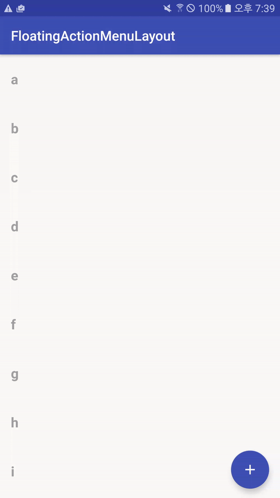

# FloatingActionMenuLayout

# 컨셉
Reference : <a href="https://material.io/guidelines/components/buttons-floating-action-button.html#buttons-floating-action-button-transitions">Floating Action Button with Toolbar</a>
 
구글 머테리얼 디자인의 Floating Action Bar(FAB)의 RecyclerView와 Toolbar와의 연동 
예제에서는 Toolbar를 사용하지 않고 LinearLayout을 사용. 
# 화면

# Licence
Copyright 2016 Bang Sunje

Licensed under the Apache License, Version 2.0 (the "License"); you may not use this file except in compliance with the License. You may obtain a copy of the License at

   http://www.apache.org/licenses/LICENSE-2.0
    
Unless required by applicable law or agreed to in writing, software distributed under the License is distributed on an "AS IS" BASIS, WITHOUT WARRANTIES OR CONDITIONS OF ANY KIND, either express or implied. See the License for the specific language governing permissions and limitations under the License.
